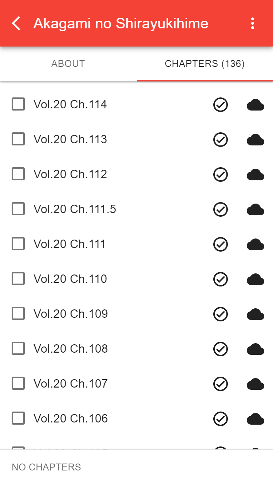
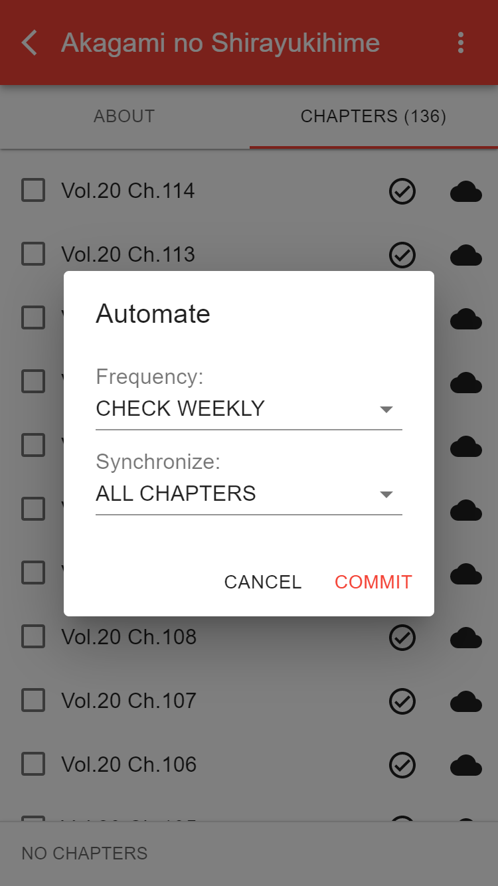
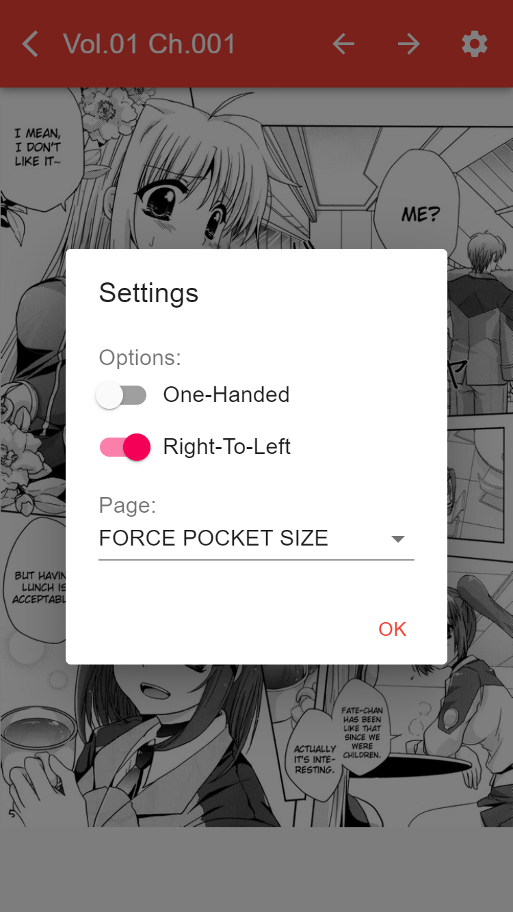
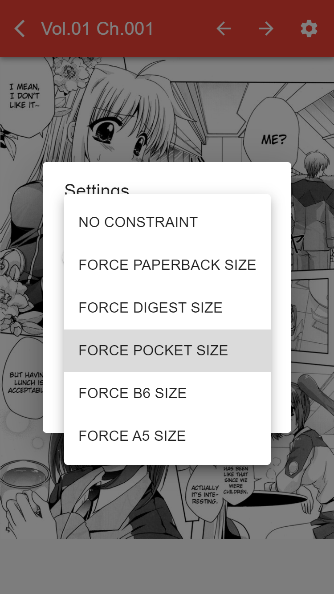

# MangaLoyalty

Your personal manga collection on your device. Your content, your rules.

## What is MangaLoyalty?

*MangaLoyalty* turns a device (`Desktop`, `Mobile`, `Server`) into a manga reader or server. Features:

* Collect, control, and stream all your favourite manga.
* Your manga, for wherever you are.
* No centralized tracking. It's your data.
* Free Software, and growing.

## MangaLoyalty in Action

<div>
    
    
    
    
</div>
<div>
    
    
    
    
</div>
<div>
    
    
    
    
</div>

## Supported Providers

* [Batoto](https://bato.to/) support is intended as an incomplete high-quality provider.
* [FanFox](https://fanfox.net/) support is intended as a complete medium-quality provider.

## Installation

*MangaLoyalty* is in **preview**. That means it is little rough around the edges. Feedback is appreciated!

### Desktop

#### Install on Windows

1. [Download the latest Windows installer](https://github.com/mangaloyalty/mangaloyalty/releases/download/v0.12.1/mangaloyalty-Setup-0.12.1.exe).
2. Run the installer. *Windows* will block the installation.
3. Click on *More Info* and then click on *Run anyway*.
4. Enjoy *MangaLoyalty*! Remember to check out [*Remote Access*](#remote-access).

#### Install on Mac

1. [Download the latest Mac installer](https://github.com/mangaloyalty/mangaloyalty/releases/download/v0.12.1/mangaloyalty-0.12.1.dmg).
2. Run the installer. Drag *MangaLoyalty* to *Applications*.
3. Run *MangaLoyalty*. *Mac* will block the application.
4. Open *Security & Privacy*. Click on the *Lock* icon to make changes.
5. Click on the *Allow* button next to the message about *MangaLoyalty*.
6. Run *MangaLoyalty*. Enjoy! Remember to check out [*Remote Access*](#remote-access).

#### Install on Linux

1. [Download the latest Linux image](https://github.com/mangaloyalty/mangaloyalty/releases/download/v0.12.1/mangaloyalty-0.12.1.AppImage).
2. Make the *MangaLoyalty* *AppImage* executable and run it.
3. Enjoy *MangaLoyalty*! Remember to check out [*Remote Access*](#remote-access).

### Mobile

#### Android

1. [Download the latest Android installer](https://github.com/mangaloyalty/mangaloyalty/releases/download/v0.12.2/mangaloyalty-0.12.2.apk).
2. Run the installer with [Files](https://play.google.com/store/apps/details?id=com.google.android.apps.nbu.files). *Android* will block the installation.
3. Click on *Settings*, enable *Allow app installs* and navigate back.
4. Click on *Install* and then click on *Install Anyway*.
5. Enjoy *MangaLoyalty*!

#### iOS

A standalone version is currently not available. **You can use *iOS* as a reader with [*Remote Access*](#remote-access)**.

### Server (Docker)

1. Ensure `docker` (https://www.docker.com/) is available on your device.
2. Run the example script below. Replace `PATH` with the path to your (new) library.
```
docker run -d \
  --cap-add=SYS_ADMIN \
  -p 7783:7783 \
  -v PATH:/home/mluser/mangaloyalty \
  mangaloyalty/mangaloyalty
```
3. Continue with [*Remote Access*](#remote-access).

### Other

1. Install `node` (http://nodejs.org/) and `npm` (https://www.npmjs.org/).
1. Run `npm install -g mangaloyalty`.
2. Run `mangaloyalty` in *terminal*.
4. Continue with [*Remote Access*](#remote-access).

## Remote Access

With *MangaLoyalty* running on `desktop` or `server`, you can connect to it using any (modern) browser.

### Desktop

1. Connect to the same local network as your server.
2. Open a modern browser and navigate to `http://IP:7783/`. Replace `IP` with the [local IP address](https://lifehacker.com/how-to-find-your-local-and-external-ip-address-5833108) of your server.
3. Enjoy *MangaLoyalty*!

### Mobile

#### Android

1. Connect to the same local network as your server.
2. Open *Chrome* and navigate to `http://IP:7783/`. Replace `IP` with the [local IP address](https://lifehacker.com/how-to-find-your-local-and-external-ip-address-5833108) of your server.
3. Open the *Menu* (right-top icon), click on *Add to Home Screen*, click on *Add* and click on *Add automatically*.
4. Close *Chrome* and you will see *MangaLoyalty* on your home screen. Enjoy *MangaLoyalty*!

#### iOS

1. Connect to the same local network as your server.
2. Open *Safari* and navigate to `http://IP:7783/`. Replace `IP` with the [local IP address](https://lifehacker.com/how-to-find-your-local-and-external-ip-address-5833108) of your server.
3. Open the *Menu* (bottom-center icon), scroll to find and click on *Add to Home Screen* and click on *Add*.
4. You will see *MangaLoyalty* on your home screen. Enjoy *MangaLoyalty*!
