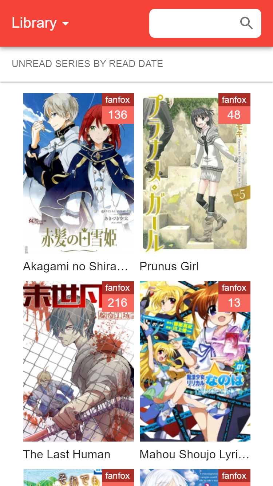
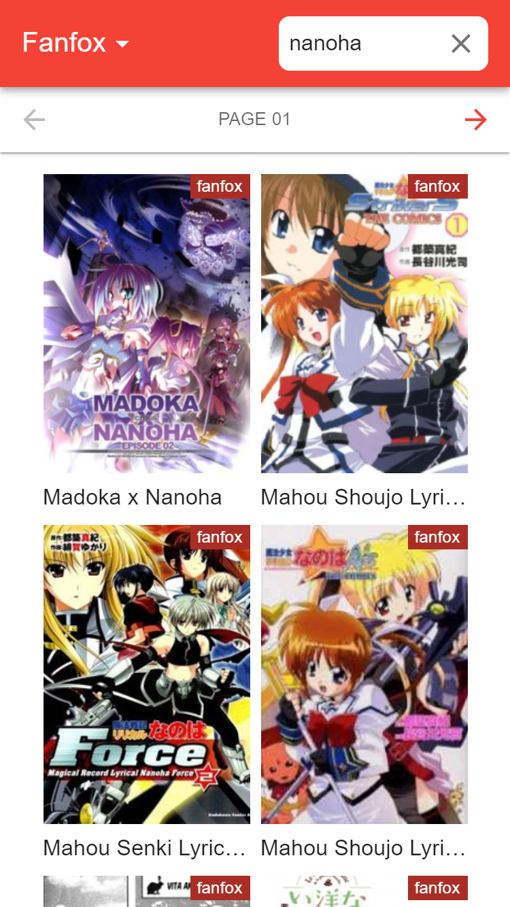

# MangaLoyalty

Your personal manga collection on your server. Your content, your rules.

## What is MangaLoyalty?

*MangaLoyalty* turns your computer (`Linux`, `Mac`, `Windows`) into a manga server. Features:

* Collect, control, and stream all your favourite manga.
* Your manga, for wherever you are.
* No centralized tracking. It's your data.
* Free Software, and growing.

## MangaLoyalty in Action

    
    
    
    

    
    
    
    

## Supported Providers

* [Batoto](https://bato.to/) support is intended as an incomplete high-quality provider.
* [FanFox](https://fanfox.net/) support is intended as a complete medium-quality provider.

## Getting Started

MangaLoyalty is in preview. That means it is a little rough around the edges. Feedback is appreciated! 

### Install on Windows

1. [Download the Windows installer](https://github.com/mangaloyalty/mangaloyalty/releases/latest/download/mangaloyalty.exe).
2. Run the installer. *Windows* will block the installation.
3. Click on *More Info* and then click on *Run anyway*.
3. Enjoy *MangaLoyalty*!

### Install on Mac

1. [Download the Mac installer](https://github.com/mangaloyalty/mangaloyalty/releases/latest/download/mangaloyalty.dmg).
2. Run the installer. Drag *MangaLoyalty* to *Applications*.
3. Run *MangaLoyalty*. *Mac* will block the application.
4. Open *Security & Privacy*. Click on the *Lock* icon to make changes.
5. Click on the *Allow* button next to the message about *MangaLoyalty*.
6. Run *MangaLoyalty*. It will work now. Enjoy *MangaLoyalty*!

### Install on Linux

1. [Download the Linux image](https://github.com/mangaloyalty/mangaloyalty/releases/latest/download/mangaloyalty.AppImage).
2. Make the *MangaLoyalty* *AppImage* executable and run it.
3. Enjoy *MangaLoyalty*!

### Other

1. Install `node` (http://nodejs.org/) and `npm` (https://www.npmjs.org/).
1. Run `npm install -g mangaloyalty`.
2. Run `mangaloyalty` in *terminal*.
4. Open http://localhost:7783/ in a browser.

## Mobile

With *MangaLoyalty* running on your computer, you can connect your mobile device.

### Android

1. Connect to the same local network as your computer.
2. Open *Chrome* and navigate to `http://IP:7783/`. Replace `IP` with the [local IP address](https://lifehacker.com/how-to-find-your-local-and-external-ip-address-5833108) of your computer.
3. Open the *Menu* (right-top icon), click on *Add to Home Screen*, click on *Add* and click on *Add automatically*.
4. Close *Chrome* and you will see *MangaLoyalty* on your home screen. Enjoy *MangaLoyalty*!

### iOS

1. Connect to the same local network as your computer.
2. Open *Safari* and navigate to `http://IP:7783/`. Replace `IP` with the [local IP address](https://lifehacker.com/how-to-find-your-local-and-external-ip-address-5833108) of your computer.
3. Open the *Menu* (bottom-center icon), scroll to find and click on *Add to Home Screen* and click on *Add*.
4. You will see *MangaLoyalty* on your home screen. Enjoy *MangaLoyalty*!
